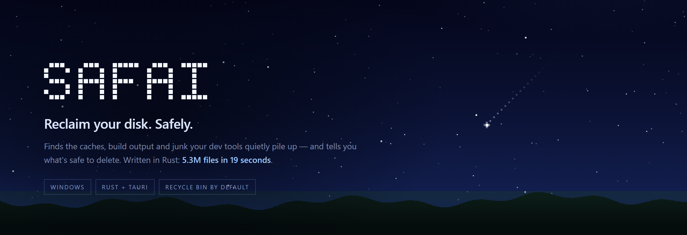

<div align="center">



<br />


### Reclaim gigabytes of disk space on your dev machine — safely.

Safai finds the caches, build artifacts, and junk your tools quietly pile up,
tells you what's safe to remove, and cleans it up to the Recycle Bin in a couple
of clicks. No guesswork. No `rm -rf` regrets.

Built in **Rust** — it reads 5.3 million files in **19 seconds**,
[**≈35× faster**](#-performance) than PowerShell's `Get-ChildItem`.

[](https://github.com/AffanShaikhsurab/safai/releases/latest)

</div>

---

## The problem

If you write code, your drive is slowly drowning.

`node_modules` you forgot about. A `target/` folder that's bigger than your whole
project. `uv`, `npm`, `pnpm`, `gradle`, `bun`, `pip`, and `cargo` caches that grow
forever and never clean themselves. Editor databases and workspace history that
balloon to tens of gigabytes. Downloaded model weights you used once.

You *know* space is disappearing — but figuring out **what** is safe to delete
means digging through `AppData`, guessing at folder names, and hoping you don't
break a project. Most people just... don't. Until the disk is full.

## What Safai does

Safai scans the places developer junk actually hides and shows you a clear,
sorted picture of what you can get back:

- **📊 See where your space went** — a clean dashboard with your drive usage,
  a breakdown by category, and how much you've reclaimed over time.
- **🔍 One-click scan** — finds package-manager caches, `node_modules` and build
  outputs, editor/app data, temp files, downloaded models, and any other large
  folders — for *any* toolchain, not just a hard-coded few.
- **🟢 Safety, built in** — every finding is tagged **Safe** (regenerates on its
  own), **Review**, or **Caution** (your data — never selected for you). Safe
  items are pre-selected; the risky stuff always needs your explicit yes.
- **🗑️ Recycle Bin by default** — nothing is gone forever unless you deliberately
  choose permanent deletion. Guardrails stop anything outside your own folders
  from ever being touched.
- **⏹️ Stop whenever** — happy with what you've found mid-scan? Hit **Stop** and
  review exactly what's there so far.
- **🔔 Get notified** — kick off a scan or cleanup and walk away; Safai pings you
  when it's done.
- **🤖 Or never think about it again** — turn on **Automation** and Safai keeps
  watch from the tray: run daily/weekly, or whenever your drive crosses a fullness
  threshold you pick. Choose *scan and tell me*, or pre-approve specific safe
  caches and let it reclaim them on its own. It waits until you're idle and on
  power, and runs at background I/O priority so you never feel it.
- **🌌 Made to look at** — three themes, and two of them are genuinely different
  apps rather than palette swaps:
  - **Nebula** — a pixel-art night sky rendered on canvas. Real starfields, a
    rare comet, a dark horizon. Content sits in a centred column so the sky has
    room to be seen.
  - **Void** — the same sky with the colour drained out. Charcoal, no blue.
  - **Pulsar** — an instrument panel instead. Metric strip, a proportional disk
    treemap, and a dense sortable table. For when you want the numbers, not the
    atmosphere.

## How it helps

- **Free up 10s of GBs in minutes** without a terminal or a wiki of folder paths.
- **Never delete something you'll regret** — clear safety tiers + Recycle Bin.
- **Works for your stack** — Node, Python, Rust, Go, Java/Gradle, Flutter/Dart,
  and more; plus generic large-folder discovery for everything else.
- **Stays out of your way** — scan, get notified, review the biggest wins first
  (results are sorted largest → smallest), clean, done.

---

## ⚡ Performance

The scanner is written in **Rust**, and the whole point of that choice is this
part: measuring a disk means touching millions of files, and anything slower than
"a few seconds" turns into an app nobody opens twice.

Scanning `C:\Users\<you>` — **5,333,449 files, 285.9 GiB**:

| Tool | Time | Files/sec |
| --- | --- | --- |
| `Get-ChildItem -Recurse` (PowerShell) | 676.4 s | ~7,900 |
| **Safai** | **19.1 s** | **~279,000** |

### ≈35× faster than the tool Windows gives you

Both walked the same tree and agreed on the total to within **0.0025%** (~7.6 MB
out of 286 GB), so that gap is traversal speed, not one tool doing less work.

<details>
<summary><b>Methodology, and how to reproduce it</b></summary>

```powershell
./benchmarks/run-benchmark.ps1 -SkipDir
```

Reference machine: Windows 11 (build 26200), Intel Core i5-13420H (8C/12T),
31.7 GB RAM, NVMe SSD, NTFS, rustc 1.97.1 release build.

- Both contenders answer one identical question: *what is the total byte size of
  this tree?* Safai's side calls `safai_core::measure::dir_size` — the real
  function the app uses during a scan, not a benchmark-only rewrite.
- Every contender gets an untimed **warm-up pass** first, so nobody pays for
  populating the NTFS metadata cache while the others don't.
- Safai's figure is the **best of 3** timed runs (median 20.9 s, mean 20.6 s).
  The PowerShell figure is a single warm pass — at ~11 minutes each, repeating it
  wasn't worth the wall clock.
- `cmd /c dir /s` isn't listed: it didn't finish two passes over this tree in
  25 minutes. It's clearly slower than PowerShell here, but "we stopped waiting"
  isn't a measurement, so it isn't presented as one.
- **Numbers are machine-specific.** Run the script on yours.

Full write-up, including why the totals differ slightly, in
**[benchmarks/README.md](./benchmarks/README.md)**.

</details>

### Where the speed comes from

- **Parallel work-stealing traversal** across every core. Directory trees are
  wildly unbalanced, so splitting "one thread per folder" leaves most threads
  idle behind the one huge folder. Work stealing means every thread piles onto
  whatever is left.
- **One syscall per entry** — sizes come from the directory listing itself, not a
  follow-up `metadata()` call per file. Across 5.3M files that halves the syscall
  count.
- **Pruning** — the walker never descends into a directory it's already treating
  as a single unit, so sizing `node_modules` doesn't mean visiting its contents
  twice.
- **No object churn** — `Get-ChildItem` allocates a full `FileInfo` per file. At
  this scale, that allocation and GC pressure *is* the runtime.
- **Background I/O priority** for scheduled scans, so automatic maintenance never
  competes with what you're actually doing.

---

## Getting started

### Download (Windows)

Grab the latest installer from
[**Releases**](https://github.com/AffanShaikhsurab/safai/releases/latest) —
download the `.exe` and run it.

### Build from source

Safai is a small native desktop app (built with [Tauri](https://tauri.app),
Rust, and SolidJS). It currently targets **Windows**.

### Prerequisites

- [**Rust**](https://www.rust-lang.org/tools/install) (stable toolchain)
- [**Node.js**](https://nodejs.org) 18+ and npm
- The [Tauri prerequisites](https://tauri.app/start/prerequisites/) for your OS
  (on Windows: the WebView2 runtime, usually already installed)

### Run it

```bash
# 1. Clone
git clone <your-repo-url> safai
cd safai

# 2. Install frontend dependencies
npm install

# 3. Launch the app in development
npm run tauri dev
```

### Build an installer

```bash
npm run tauri build
```

The installer is produced under `src-tauri/target/release/bundle/`.

---

## Using Safai

1. **Scan** — open **Clean**, pick your scan mode (Quick or Deep), and hit scan.
   Deep scan also hunts for large folders no rule knows about.
2. **Review** — findings are grouped into collapsible sections, sorted biggest
   first. Flip a whole section on, or cherry-pick items. Safe items start
   selected; **Caution** items never do.
3. **Clean** — choose **Recycle Bin** (default, recoverable) or **Permanent**,
   confirm the preview, and Safai does the rest.

Your reclaimed total and history live on the **Overview**.

### Themes

**Settings → Appearance.** Nebula and Void share one layout; Pulsar uses a
different one entirely. Under the two sky themes you can also tune the starfield
— comet frequency, star density, pixel size, the horizon ridge, and motion (which
always defers to your system's reduce-motion setting).

---

## Brand assets

| File | What it is |
| --- | --- |
| `assets/safai-logo.svg` | The logo. Hand-drawn on a 4-unit pixel grid, so it holds up at favicon size. |
| `assets/safai-banner.png` | The README banner, rendered at 2x. |
| `assets/banner.html` · `assets/logo.html` | The **sources**. Both PNGs are generated, not hand-edited. |

```bash
npm run assets          # re-render both
```

Rendering goes through `scripts/render-asset.mjs`, which drives whichever
Chromium-based browser is already installed via `--headless --screenshot` — no
180MB Puppeteer download for a job Edge already does.

Two deliberate choices in the banner source: the wordmark is built from a
hand-authored 5×7 pixel bitmap rather than set in a webfont (a headless render
can't guarantee a font request resolves, and a silent fallback to Courier would
ship a broken banner), and the starfield uses a seeded PRNG so re-rendering
produces a byte-identical sky instead of a meaningless binary diff.

## Is it safe?

Yes — safety is the whole point:

- **Recycle Bin by default** — deletions are recoverable unless you opt into
  permanent removal.
- **Guardrails** — Safai only ever deletes inside your own known locations,
  never system paths.
- **You're always in control** — nothing is removed without a confirmation, and
  a dry-run preview shows exactly what will go.

---

## Contributing

Contributions are welcome! See **[CONTRIBUTING.md](./CONTRIBUTING.md)** to get set
up and learn how to propose changes.

## License

[MIT](./LICENSE) © Safai
